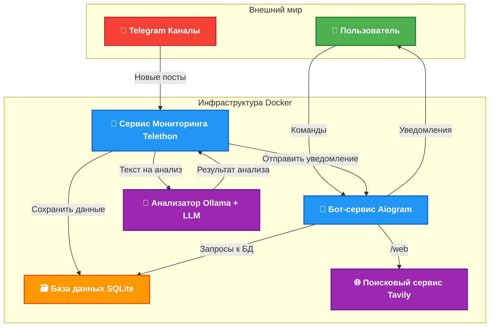

# NewsGuard AI: Ваш Персональный Аналитик Новостей в Telegram


> 🤖 Этот проект — не просто бот. Это интеллектуальный ассистент, который превращает информационный хаос новостных лент в структурированный и осмысленный дайджест. Он самостоятельно отслеживает Telegram-каналы, анализирует контент с помощью локально развернутой нейронной сети и доставляет вам самую суть, экономя ваше время и силы.

## 🏛️ Архитектура Проекта

Система спроектирована с использованием модульного подхода, где каждый компонент выполняет свою четко определенную задачу. Это обеспечивает гибкость, масштабируемость и простоту поддержки.



**Логика работы:**
1.  **Сервис Мониторинга (`monitoring_service.py`)**: Работает под капотом с помощью `Telethon` как пользовательский аккаунт. Он подключается к указанным каналам и отслеживает появление новых сообщений.
2.  **Анализатор (`llm_analyzer.py`)**: Получив новый пост, сервис мониторинга передает его текст в анализатор. Тот, в свою очередь, обращается к локально развернутой LLM через `Ollama` для генерации краткой сводки, определения тональности и подбора релевантных хештегов.
3.  **Уведомления (`telegram_notifier.py`)**: Готовый анализ отправляется всем подписанным пользователям через основной бот-сервис на `Aiogram`.
4.  **Интерактивность (`bot_services.py`)**: Пользователи могут напрямую взаимодействовать с ботом, подписываться/отписываться от рассылки и использовать дополнительные команды, например, `/web` для поиска информации в интернете через `Tavily API`.
5.  **Хранение данных (`data_manager.py`)**: Вся информация (ID обработанных сообщений, подписчики, результаты анализа) надежно хранится в локальной базе данных `SQLite`.

## 🚀 Ключевые Возможности

-   **🎯 Мультиканальный мониторинг**: Одновременное отслеживание множества публичных Telegram-каналов.
-   **🧠 Локальный AI-анализ**: Использование `Ollama` для запуска LLM на вашей машине гарантирует 100% приватность данных и независимость от облачных провайдеров.
-   **📰 Умные дайджесты**: Получение структурированных отчетов: краткая выжимка, тональность (позитив/негатив/нейтрально) и тематические хештеги.
-   **🌐 Интеграция с вебом**: Команда `/web` позволяет мгновенно находить дополнительную информацию по любому запросу.
-   **🐳 Простое развертывание**: Проект полностью контейнеризован с помощью `Docker` и `Docker Compose`. Запуск всей системы сводится к одной команде.
-   **asynchronous**: Весь код написан с использованием `asyncio`, что обеспечивает высокую производительность и отзывчивость.

## 🛠️ Технологический Стек и Обоснование

| Технология      | Роль в проекте                                                                                                        | Почему именно она?                                                                                                                                                                                            |
| :-------------- | :-------------------------------------------------------------------------------------------------------------------- | :------------------------------------------------------------------------------------------------------------------------------------------------------------------------------------------------------------ |
| **Aiogram 3**   | Фреймворк для создания Telegram-бота (общение с пользователями)                                                          | Наиболее мощный и современный асинхронный фреймворк для ботов. Обеспечивает высокую производительность и удобный интерфейс для разработки.                                                                         |
| **Telethon**    | Библиотека для работы с Telegram API (мониторинг каналов)                                                               | В отличие от `aiogram`, позволяет авторизоваться как пользователь, а не бот. Это необходимо для чтения сообщений в каналах, куда бот не может быть добавлен.                                                         |
| **Ollama**      | Платформа для локального запуска LLM                                                                                    | Предоставляет простой и удобный REST API для взаимодействия с большими языковыми моделями (такими как Llama, Mistral, Qwen) прямо на вашей машине, без отправки данных вовне.                                    |
| **SQLite**      | Реляционная база данных                                                                                               | Легковесная, не требует отдельного сервера, идеально подходит для небольших и средних проектов. Файл БД легко бэкапировать. Асинхронная библиотека `aiosqlite` обеспечивает неблокирующий доступ к данным. |
| **Docker**      | Система контейнеризации                                                                                               | Обеспечивает идентичность окружения на любой машине. Упрощает установку и запуск, изолируя все зависимости (Python, Ollama, библиотеки) в контейнеры.                                                          |

## ⚙️ Быстрый старт с Docker

### Шаг 1: Подготовка
- Убедитесь, что у вас установлены `Git` и `Docker` с `Docker Compose`.
- Клонируйте репозиторий:
  ```bash
  git clone https://github.com/000p1umDiesel/telegram_bot_news_analyzer
  ```

### Шаг 2: Конфигурация
- Создайте файл `.env` в корне проекта, скопировав `example.env` (если он есть) или создав новый.
- Заполните его вашими данными. Это — сердце конфигурации вашего проекта.

```env
# ======== Telegram API (для мониторинга через Telethon) ========
# Получить можно на my.telegram.org
TELEGRAM_API_ID=ВАШ_API_ID
TELEGRAM_API_HASH=ВАШ_API_HASH

# ======== Telegram Bot (для общения с пользователями) ========
# Токен бота, полученный у @BotFather
TELEGRAM_BOT_TOKEN=ВАШ_ТОКЕН_БОТА

# ======== Каналы для мониторинга ========
# ID или юзернеймы каналов через запятую, БЕЗ кавычек и @
# Пример: TELEGRAM_CHANNEL_IDS=meduzalive,lentach,rbc_news
TELEGRAM_CHANNEL_IDS=...

# ======== LLM (Ollama) ========
# URL к Ollama. При использовании Docker Compose, НЕ МЕНЯЙТЕ это имя.
OLLAMA_BASE_URL=http://ollama:11434
# Модель, которую будет использовать бот.
# Она будет автоматически скачана при первом запуске.
OLLAMA_MODEL=ilyagusev/saiga_llama3

# ======== Web Search (Tavily) ========
# API ключ для поиска. Получить можно на https://tavily.com/
TAVILY_API_KEY=ВАШ_КЛЮЧ_TAVILY
```

### Шаг 3: Создание сессии Telethon (ОБЯЗАТЕЛЬНО)
`Telethon` работает от имени пользователя, поэтому ему нужна активная сессия.
- Запустите скрипт для интерактивной авторизации:
  ```bash
  python3 init_session.py
  ```
- Скрипт попросит вас ввести номер телефона, код из Telegram и, возможно, пароль 2FA.
- После успеха в папке `.sessions` появится файл `telegram_session.session`. **Этот шаг нужно выполнить только один раз.**

### Шаг 4: Запуск!
- Соберите и запустите все контейнеры:
  ```bash
  docker-compose up --build
  ```
- Команда `--build` пересобирает образ, если вы меняли код.
- При первом запуске `Docker` скачает все необходимые образы, а `Ollama` — указанную языковую модель. **Это может занять значительное время и потребует >10 GB свободного места.**

### Остановка
- Чтобы остановить сервисы, нажмите `Ctrl+C` в терминале, а затем выполните:
  ```bash
  docker-compose down
  ```
- Эта команда остановит и удалит контейнеры, но сохранит все важные данные (модели, сессию, БД), так как они вынесены в `volumes`.

## 🕹️ Команды Бота

| Команда         | Описание                                           |
| :-------------- | :------------------------------------------------- |
| `/start`        | Показывает приветственное сообщение.               |
| `/subscribe`    | Подписывает вас на получение аналитических сводок. |
| `/unsubscribe`  | Отписывает вас от рассылки.                        |
| `/web <запрос>` | Выполняет поиск в интернете по вашему запросу.      |

## 🌳 Структура Проекта
```
.
├── .dockerignore           # Файлы, которые не нужно копировать в Docker
├── .gitignore              # Файлы, которые игнорирует Git
├── .sessions/              # Директория для хранения сессии Telethon
├── data/                   # Директория для хранения базы данных SQLite
├── Dockerfile              # Инструкции по сборке Docker-образа приложения
├── docker-compose.yml      # Оркестрация сервисов (приложение, Ollama)
├── config.py               # Загрузка и управление конфигурацией из .env
├── data_manager.py         # Взаимодействие с базой данных (CRUD операции)
├── init_session.py         # Скрипт для первичной авторизации Telethon
├── llm_analyzer.py         # Логика анализа текста через Ollama
├── logger.py               # Настройка логирования
├── main.py                 # Главная точка входа, запускает все сервисы
├── monitoring_service.py   # Основная логика мониторинга каналов
├── requirements.txt        # Список Python-зависимостей
├── services.py             # Централизованная инициализация сервисов
├── tavily_search.py        # Логика поиска в вебе через Tavily
├── bot_services.py         # Обработчики команд и сообщений от пользователя (хендлеры)
└── telegram_notifier.py    # Функция для отправки уведомлений пользователям
```

## 🔮 Планы по развитию

- [ ] Создание веб-интерфейса для управления подписками и просмотра аналитики.
- [ ] Реализация подписки по ключевым словам.
- [ ] Расширенная аналитика: тренды, графики, сравнение источников.
- [ ] Переход на более мощную БД (например, `PostgreSQL`) для больших объемов данных.
